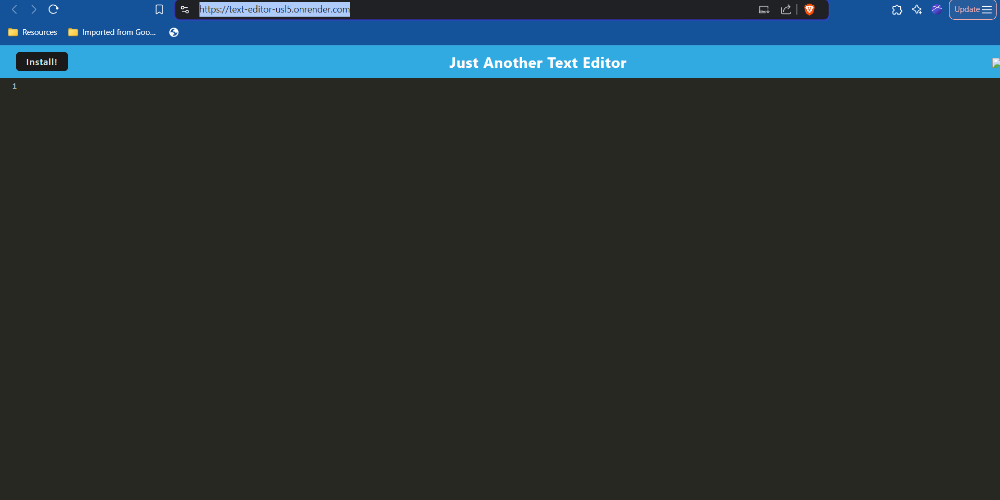

# text-editor

## Dscription

A text editor that saves text to the browser's indexedDb in order to persist information

## Link to Deployed Application

https://text-editor-usl5.onrender.com/

## Screenshot

## Credits

Xpert Learning Assistant from Bootcamp Spot.

Miranda Lipscomb shared code for her maifest inject in order to help debug some issues I was having.
Link: https://github.com/mlipscomb24/Just-Another-Text-Editor_19
